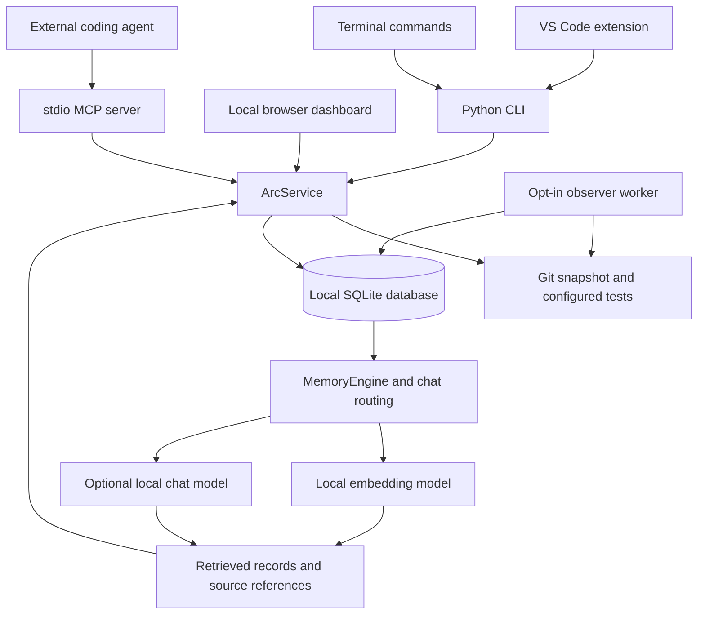

# A.R.C. technical overview: from startup to a local AI answer

This document explains the current repository implementation, checked against the source on 10 October 2026. A.R.C. means **Agent Recall & Continuity**. It keeps development evidence in a local database so a developer or coding agent can recover project context in a later session.

The central flow is:

**Record development events → save them in SQLite → index their summaries → retrieve relevant evidence → show a cited answer or handoff.**

## 1. What the system consists of

| Component | Technology | Responsibility |
|---|---|---|
| Backend and CLI | Python 3.11+, `argparse` | Register projects, record events, run configured tests, retrieve memory, derive task state |
| Persistent memory | SQLite, FTS5, WAL mode | Store evidence, sessions, tasks, incidents, vectors, and observer state |
| Git collector | Git subprocesses, SHA-256 | Observe eligible paths, commits, branches, and project fingerprints |
| Local model runtime | Ollama on `127.0.0.1:11434` | Run downloaded embedding and conversational models |
| Semantic retrieval | `all-minilm` by default | Turn event summaries and questions into comparable numerical vectors |
| Conversational answers | CLI default `qwen3:1.7b`; selectable in VS Code | Write an answer from a bounded set of retrieved records |
| Editor interface | TypeScript VS Code extension | Connect projects, display memory/chat, supervise observation and local AI setup |
| Browser interface | Python HTTP server, vanilla JavaScript/CSS | Display project evidence at `127.0.0.1:8765` |
| Agent interface | MCP over standard input/output | Expose project memory and inspectable sources to an external coding agent |

`ArcService` is the shared backend interface. The CLI, dashboard, and MCP server call its methods. The extension invokes the Python CLI and reads its JSON responses.



Source: [service.py](../arc/service.py), [cli.py](../arc/cli.py), [backend.ts](../extension/src/backend.ts).

## 2. Startup: how a project gets connected

Install the Python package, Git, and optionally Ollama. Download models while internet access is available. Install the extension's Node dependencies if using VS Code. The [README setup](../README.md#set-up-on-macos) and [local chat guide](LOCAL_CHAT.md) cover the existing setup paths.

When a project is registered, A.R.C. resolves its Git root and stores its absolute path, name, ID, and optional approved test command. Registering a project records an existing repository; it does not scaffold an application.

The database path matters because all interfaces must read the same memory:

- The CLI accepts `--db`, then uses `ARC_DB` or its platform default.
- The extension chooses `arc.databasePath`, then `ARC_DB`, then an existing `.arc/arc.sqlite3` found while walking toward the repository root; otherwise it uses the backend default.
- The MCP server requires explicit `ARC_PROJECT` and `ARC_DB` values.

The extension selects the configured `arc.pythonPath`, a workspace `.venv` interpreter, or a platform Python fallback. It passes the selected model names as `ARC_EMBEDDING_MODEL` and `ARC_CHAT_MODEL` to Python subprocesses.

For automatic editor sessions, the extension requires a trusted workspace and project approval. An approved selection can reconnect on startup. Observation has a separate opt-in; merely connecting does not authorize collecting Git activity.

Source: [extension.ts](../extension/src/extension.ts), [store.py](../arc/store.py), [mcp_server.py](../arc/mcp_server.py).

## 3. How development activity becomes memory

A.R.C. records structured **events**. Examples include decisions, notes, errors, attempts, Git observations, configured test results, reported resolutions, task corrections, and explicit confirmations.

Events come from two main paths:

1. **Explicit recording:** commands such as `arc note`, `arc capture`, and `arc test` call `ArcService` and save evidence.
2. **Automatic observation:** after opt-in, a worker polls Git about every five seconds and saves eligible changes and commit metadata.

The observer compares the current fingerprint, HEAD, and branch with its persisted baseline. It gathers Git information before taking a short SQLite write lock, then checks that another collector has not already advanced the baseline. Repeated polls of unchanged state do not create another observation.

Commit recovery reads reachable commits after the saved cursor in batches of up to 100. It stores commit messages, eligible paths, and the original UTC commit timestamp, with a separate observation time. A non-fast-forward HEAD move, such as a rebase or checkout, is handled as a baseline change rather than invented new commits. No Git push is required.

Pause/resume resets the collection baseline so activity from an intentionally paused interval is not imported afterward. A file edit that is reverted between polls can be missed. The worker records observed facts; reasons, debugging outcomes, and tests need explicit recording or the supported test command path.

Source: [observer.py](../arc/observer.py), [git_evidence.py](../arc/git_evidence.py).

## 4. What SQLite stores

SQLite is the durable project memory. A simplified event looks like this; the IDs and values below are illustrative:

```json
{
  "id": "example-event-id",
  "project_id": "example-project-id",
  "task_id": null,
  "session_id": "example-session-id",
  "kind": "decision",
  "summary": "Use a local dashboard because project history must remain available offline.",
  "source": "explicit",
  "source_ref": "arc:event/example-event-id",
  "git_head": "example-commit-hash",
  "fingerprint": "example-sha256",
  "details": {},
  "created_at": "2026-10-10T04:00:00+00:00"
}
```

The database stores `details` as JSON text in `details_json`; service responses decode it into an object.

| Table | Purpose |
|---|---|
| `projects` | Registered repository paths and approved test commands |
| `sessions` | Work boundaries, origin, activity times, checkpoint bookkeeping |
| `workspace_connections` | Owner IDs, process IDs, and heartbeat times for connected clients |
| `tasks` | Task titles, claims, and confirmation bookkeeping |
| `events` | Recorded summaries, source references, timestamps, task/session links, Git evidence |
| `event_fts` | Full-text index of event summaries for keyword search |
| `vectors` | Event embeddings as JSON float arrays, with their model name |
| `incidents`, `incident_links` | Original errors linked to attempts, resolutions, and tests |
| `checkpoints` | Saved candidate project-state snapshots |
| `project_controls` | Project-level recording pause |
| `observer_state` | Observation opt-in, pause, baseline, commit cursor, branch, and worker PID |
| `model_lease` | Short-lived ownership of a local model request; created when needed |

New events and their FTS rows are inserted together. Foreign keys enforce relationships; a unique partial index allows only one active session per project. WAL mode and a five-second busy timeout support multiple processes sharing the database. Short `BEGIN IMMEDIATE` transactions protect operations that must choose a single owner or advance a shared cursor.

Opening an older database adds supported missing columns and tables. The database persists across restarts; model RAM does not hold the authoritative history. macOS file mode is restricted to `0600`; that is a permission setting, not database encryption.

Source: [store.py](../arc/store.py).

## 5. How the local AI works

### Two model roles

The **embedding model** maps text to numbers for retrieval. The **chat model** generates words from supplied evidence. They perform different jobs and can be configured independently.

`all-minilm` is the default embedding model. Existing validation recorded a 384-value vector for that model. The code accepts vectors dynamically rather than hard-coding that dimension.

The Python chat default is `qwen3:1.7b`. VS Code starts with an empty chat-model setting and uses evidence-only chat until an installed conversational model is selected and ready.

### What “local” means in this implementation

The Python backend sends HTTP requests to Ollama on the same computer:

| Endpoint | Use |
|---|---|
| `GET /api/tags` | Check installed models without loading them |
| `POST /api/embed` | Generate a text embedding |
| `POST /api/chat` | Generate an answer or select evidence IDs |
| `POST /api/pull` | Download a selected model during setup, with extension consent |

The Python clients bypass HTTP proxies. The embedding client only accepts an HTTP URL whose hostname is `127.0.0.1` or `localhost`; chat uses the fixed loopback endpoint.

If configured to auto-start Ollama, the extension reuses an existing server or launches an installed executable in the background. Its startup environment sets `OLLAMA_NO_CLOUD=1`, `OLLAMA_MAX_LOADED_MODELS=1`, `OLLAMA_NUM_PARALLEL=1`, and `OLLAMA_KEEP_ALIVE=30s`. A shared startup lock reduces races between windows. Reusing an existing Ollama server does not change that server's startup configuration.

The extension rejects `:cloud` model selections and checks that installed entries do not advertise remote models. The Python clients have no separate cloud-provider fallback; their endpoint is local. CLI environment overrides are less restrictive than the extension's model-selection checks, so loopback transport alone does not validate every possible model installed in Ollama.

Once dependencies and local model weights are installed, ordinary local inference does not need internet. Model downloads do. An external coding agent connected through MCP has its own runtime and network behavior; A.R.C.'s local model setup does not make that agent local.

### Retrieval rather than retraining

A.R.C. does not train or fine-tune a model whenever you work. It stores records, creates embeddings, and supplies retrieved records with each relevant question. This is a **retrieval-augmented generation (RAG)** pattern.

The pretrained model supplies its language capabilities. SQLite supplies the project history. Restarting or unloading the model does not erase the stored history.

Source: [memory.py](../arc/memory.py), [chat.py](../arc/chat.py), [ollama.ts](../extension/src/ollama.ts).

## 6. How indexing and semantic search work

### Indexing a record

For each pending event in the selected project:

1. Read its summary from SQLite.
2. Normalize a searchable copy with Unicode NFKC and whitespace normalization, limited to 2,000 characters. The recorded summary remains unchanged.
3. Acquire the shared model lease.
4. Send the text to `/api/embed`.
5. Validate that the returned vector contains finite numbers.
6. Save the vector and model name against the event ID.

The embedding request has this shape:

```json
{
  "model": "all-minilm",
  "input": "Normalized recorded summary",
  "keep_alive": "30s"
}
```

An event without a vector for the selected model is pending work. SQLite itself is the durable queue. The observer tries at most two records per indexing retry, roughly every 30 seconds; failed embedding requests leave unprocessed records pending. The extension also attempts small batches when the embedding model is ready.

The current schema holds one vector row per event, not one per event/model pair. Changing the selected embedding model makes incompatible rows pending, and reindexing replaces them. The same model name is assumed to identify the same embedding space; changed weights under an unchanged tag are not separately versioned.

### Finding related records

For semantic search, A.R.C. embeds the question and compares its vector with stored vectors from the **same project and model**, optionally filtered by event kind.

It computes cosine similarity:

```text
cosine(q, e) = sum(q[i] * e[i]) / (length(q) * length(e))
```

Vectors pointing in similar directions get higher scores. For example, “Why did we choose an offline interface?” may retrieve a decision about a local dashboard despite different wording.

The implementation scans vectors in Python and sorts the scores. It does not use a separate vector database or an approximate nearest-neighbor index. Its work grows roughly with `number of indexed records × vector dimension`. Search returns at most 20 hits. A cosine score measures numerical similarity, not factual confidence; general search can return weak matches.

### Keyword and hybrid alternatives

FTS5 keyword search tokenizes the question, removes common stopwords, uses up to ten remaining tokens with OR matching, and orders records by SQLite BM25. The returned score is `1 / result rank`, rather than the raw BM25 value.

Hybrid search combines the top semantic and keyword rankings with reciprocal rank fusion:

```text
fused_score(event) = sum(1 / (60 + rank_in_each_result_list))
```

Default search falls back to keyword results when embeddings are unavailable or no records are indexed. `--semantic-only` does not allow that fallback; `--keyword-only` skips embedding entirely. Responses include the retrieval mode, score kind, and indexed/pending counts.

Source: [memory.py](../arc/memory.py), [store.py](../arc/store.py).

## 7. How a question becomes a cited answer

The chat backend first routes the question using rules rather than sending every question directly to a model:

| Question type | Retrieval path |
|---|---|
| Today, yesterday, a time, or explicit date range | UTC timeline bounds derived from the supplied local offset |
| Latest or earliest change | A single matching timeline event |
| A known task title or ID | Linked task history and current evidence review |
| What remains unfinished / where did we leave off? | Deterministic project handoff plus selected records |
| Which errors were fixed? | Reported resolutions linked back to errors and optional tests |
| Why was a choice made? | Recorded decisions, causes, explanatory notes, or commit messages |
| A broader factual question | Semantic retrieval with keyword fallback |

Timeline and task-history routes can produce deterministic answers directly. Routes such as rationale, handoff, and general retrieval can ask the chat model to write an introduction and select supporting IDs.

A model answer request includes at most 12 events. Each includes an ID, kind, timestamp, and summary clipped to 400 characters; the question is clipped to 1,000 characters in that request. Settings include `stream: false`, `think: false`, a 4,096-token context, a 512-token generation limit, and temperature zero. `keep_alive: 0` requests that Ollama unload the chat model afterward.

The model must return structured JSON:

```json
{
  "answer": "A short answer supported by the supplied records.",
  "event_ids": ["an-id-from-the-retrieved-events"]
}
```

Python validates the answer shape and checks that every returned ID belongs to the supplied evidence. Unknown IDs, missing supporting citations, malformed output, timeouts, and model failures fall back to recorded evidence with a notice.

The response contains `answer` for deterministic evidence lines, `answer_intro` for the model introduction or a deterministic introduction, and `citations` for inspectable source cards. It also includes retrieval mode and history continuation fields where relevant.

**Valid citations do not prove every sentence generated by the model is supported.** A recorded trial found a correctly cited decision accompanied by extra unsupported reasons. The implementation validates IDs, not sentence-by-sentence entailment. Evidence inspection remains necessary when accuracy matters.

Chat also does not feed a complete earlier conversation into every request: the current question and retrieved evidence are the supplied context. Timeline continuation uses `next_offset` and `snapshot_rowid` to keep pages stable as new records arrive. Chat groups repeated observer Git events by local day; the raw timeline keeps all events.

Source: [chat.py](../arc/chat.py), [local chat guide](LOCAL_CHAT.md), [recorded validation](PHASE_12_VALIDATION.md).

## 8. How A.R.C. decides whether work is verified

Task state is calculated from linked evidence rather than accepted from an AI statement:

| State | Evidence required |
|---|---|
| `planned` | No qualifying linked Git implementation observation |
| `implementation_observed` | A linked Git event showing eligible changed paths |
| `tests_passed` | Observed implementation plus a linked passing configured test at the current fingerprint |
| `completed_confirmed` | The preceding evidence plus explicit confirmation at the current fingerprint |

An agent claim stays unverified. Automatic observer records have no task ID and cannot advance a task by themselves.

### What the fingerprint measures

The SHA-256 fingerprint includes Git HEAD and the sorted eligible changed/untracked paths. For each such path, the collector includes its name, Git index metadata, and working-file bytes or symlink target. Sensitive/generated paths are filtered before content hashing. File bytes are read to hash them; they are not stored in the event.

An unchanged committed tree is represented by HEAD; a commit changes HEAD and therefore changes the fingerprint. Fingerprints represent selected Git state, not every external dependency, runtime setting, or deployment condition.

### What a passing test means

`arc test` splits the configured command into arguments and executes it without a shell, in the project directory. The default execution timeout is 120 seconds. It captures fingerprints before and after, plus exit code and a redacted output tail.

```text
recorded_pass = exit_code == 0 AND fingerprint_before == fingerprint_after
current_test = recorded_pass AND recorded_fingerprint == current_fingerprint
```

Changing eligible project state makes previous tests and confirmations historical. A checkpoint can similarly become stale. A test result proves the configured command's result for its recorded snapshot; it does not automatically prove that an entire feature works.

Task corrections are recorded as events with reasons and invalidate earlier qualifying evidence according to the correction target. The original history remains inspectable.

Source: [service.py](../arc/service.py), [git_evidence.py](../arc/git_evidence.py), [contracts.py](../arc/contracts.py).

## 9. Sessions, handoffs, and crash recovery

The extension opens a workspace connection with a random owner ID and its process ID. Multiple connections for the same project share one active session. The editor refreshes roughly every ten seconds and attempts a heartbeat every third refresh, when the backend is available. The observer worker also maintains its own connection while running.

Connections expire when their heartbeat is more than 90 seconds old or their process is dead. On the next open, an abandoned automatic session can be closed using recorded activity/heartbeat times and a new session started. The last connection closing ends an automatic session; an observer connection can therefore keep it open after an editor window closes.

Automatic sessions rotate after 30 minutes without recorded activity. Heartbeats maintain connections but do not count as development events. Periodic checkpoints are due after five minutes when new session events exist; final close can also trigger a candidate checkpoint.

`arc handoff` reads current Git state, tasks, recent sessions, and up to the newest 1,000 events. It selects source-linked decisions, failures, attempts, resolutions, corrections, and progress. Ranking gives priority to important categories, unfinished-task links, and recent activity, with duplicate summaries removed.

The normal evidence limit is six, configurable up to 12. Task lists are bounded, and the response exposes counts and history-window truncation. The suggested next task prioritizes work awaiting confirmation, then observed implementation, then planned work, with recent activity used in ordering. It is a recorded-state suggestion.

**Handoff generation requires neither an embedding index nor an LLM.** A developer can recover unfinished work even when Ollama is stopped.

Source: [store.py](../arc/store.py), [handoff.py](../arc/handoff.py), [service.py](../arc/service.py), [extension.ts](../extension/src/extension.ts).

## 10. How the interfaces share the backend

### VS Code

The extension uses `execFile`/`spawn` with argument arrays to invoke `python -m arc.cli`. It parses JSON from stdout and displays tree items, chat text, and source cards. Requests have bounded buffers and timeouts. Generation checks suppress responses from a project that was disconnected while a request was running.

Chat action requests map to predefined extension commands. Most show an action button; enabling observation opens its permission dialog. The chat model does not provide arbitrary shell execution.

### Browser dashboard

The dashboard serves bundled HTML, CSS, and JavaScript through Python's standard-library HTTP server on loopback. It calls the same service layer for state, handoffs, search, history, and evidence inspection. Mutations require a per-server request token; the server checks the loopback Host header and sets a restrictive content policy. Recorded strings are rendered as text.

### MCP

The MCP server runs as a subprocess using stdio transport. Tools such as `arc_get_project_handoff`, `arc_search_memory`, `arc_get_task_review`, and `arc_get_event` expose evidence for the configured project. Most tools are read-only; `arc_create_checkpoint` saves an unconfirmed candidate snapshot. There is no MCP tool for arbitrary shell execution or running tests.

An agent retrieves a handoff, inspects cited records, and then checks current files before continuing. Automatic injection into every new agent conversation is not guaranteed by running the MCP server.

Source: [backend.ts](../extension/src/backend.ts), [extension.ts](../extension/src/extension.ts), [dashboard.py](../arc/dashboard.py), [mcp_server.py](../arc/mcp_server.py).

## 11. Privacy and resource behavior

Git capture stores metadata, paths, and fingerprints rather than raw source files or diffs. Semantic indexing embeds recorded summaries. Explicit notes and configured test-output tails are still stored text; common token/password patterns are redacted, but that filter is limited.

Excluded paths include common secret files, database files, `.arc/`, `.git/`, virtual environments, build outputs, and `node_modules`. A project can add exclusion patterns through `.arcignore`. Observation pause and project-wide recording pause are separate controls. Existing records can still be read and indexed while recording is paused.

A shared database-backed model lease serializes embedding and chat requests from processes using that database. If occupied, the caller receives an unavailable/busy result rather than waiting indefinitely; keyword evidence can still be used. The lease expires after 90 seconds if its owner dies. This coordination is per database, not a universal lock for every Ollama client on the machine.

Embedding requests retain the model for 30 seconds; chat requests ask for immediate unload afterward. Small indexing batches limit bursts but do not establish a fixed hardware or memory requirement. Without Ollama, recording, keyword search, deterministic chat routes, evidence review, and handoffs remain available.

Source: [memory.py](../arc/memory.py), [model_gate.py](../arc/model_gate.py), [observer.py](../arc/observer.py), [ollama.ts](../extension/src/ollama.ts).

## 12. An example from first record to later recall

Assume the package is installed, the terminal environment is active, this Git project is registered, and every interface uses the same `ARC_DB`. For semantic retrieval, Ollama must be running with the selected embedding model installed; a selected chat model is needed for model-written introductions.

```bash
arc session start "Dashboard work"
arc note --kind decision "Use a local dashboard because project history must remain available offline."
# Make an actual project change before capture.
arc capture
arc index
arc search "Why did we choose an offline interface?"
arc chat "Why did we choose a local dashboard?"
arc handoff
arc session end
```

The decision becomes an event and an FTS entry. Indexing adds its embedding. Search embeds the question and ranks matching records. The rationale chat route retrieves explanatory evidence and can ask the local model to write an introduction using its IDs. The response exposes source references for inspection. A later handoff can include the same decision from SQLite after the process and model have restarted.

For task verification, attach capture and configured test events to a real task using `--task TASK_ID`, inspect `arc task review TASK_ID`, and explicitly confirm only after the required evidence exists. The [project workflow](PROJECT_WORKFLOW.md) covers that sequence.

## 13. Current implementation limits

- Polling can miss transient changes; file paths cannot establish a developer's reason for a change.
- Model answers can add unsupported wording even with valid source IDs.
- Semantic ranking is a linear scan, and the vector store currently retains one embedding model per event.
- Date filtering uses a supplied fixed UTC offset; historical daylight-saving rules are not implemented.
- A fingerprint does not capture the entire runtime environment, and a configured test is limited to what that command checks.
- Automatic editor lifecycle behavior has automated coverage, but the documented real VS Code host, sustained resource, and broader offline/accuracy gates remain open.

The [test log](TEST_RESULTS.md) and [Phase 12 checklist](PHASE_12_VALIDATION.md) distinguish recorded validation from remaining checks. This overview documents source behavior; it is not a new live-model or offline test report.
